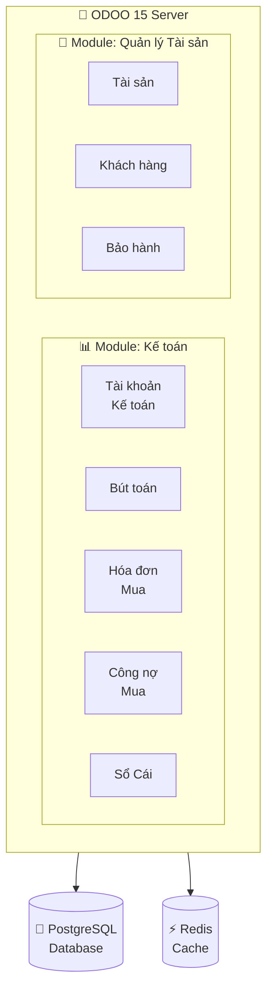
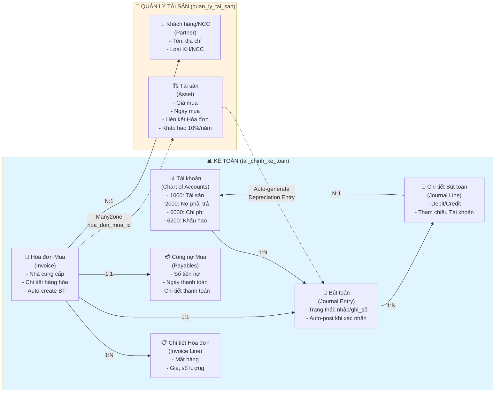
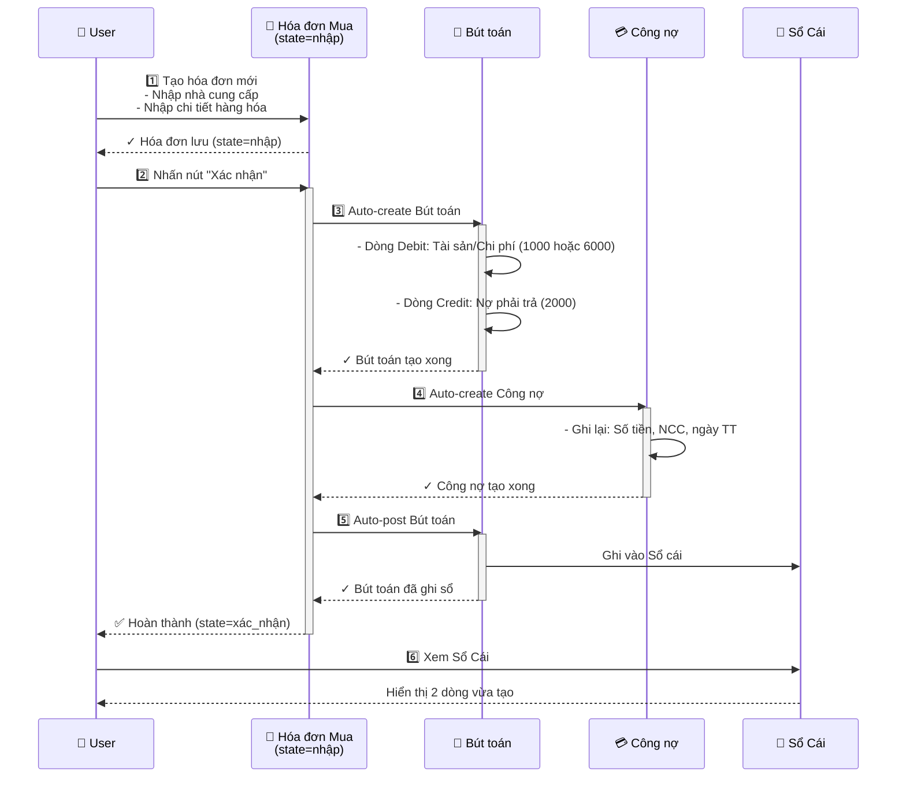
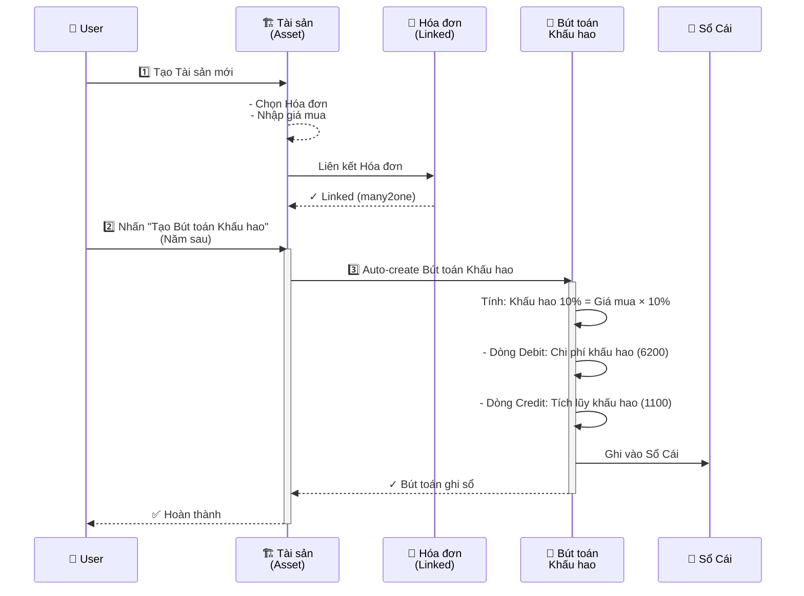
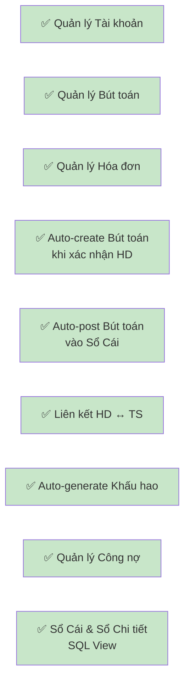
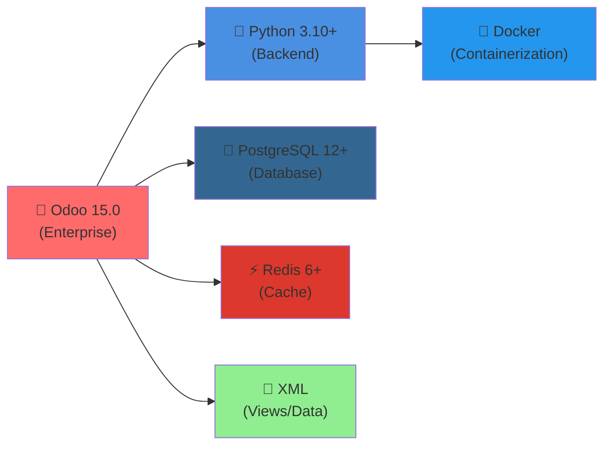
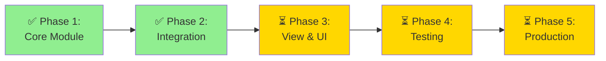

# 📊 DỰ ÁN ODOO 15 - HỆ THỐNG KỂ TOÁN & QUẢN LÝ TÀI SẢN

## 🏗️ KIẾN TRÚC TỔNG QUÁT



---

## 🔗 SƠ ĐỒ LIÊN KẾT DỮ LIỆU



---

## 🔄 QUY TRÌNH: HÓA ĐƠN → BỤT TOÁN (INVOICE WORKFLOW)



---

## 📈 QUY TRÌNH: KHẤU HAO TÀI SẢN (DEPRECIATION WORKFLOW)



---

## 📋 DANH SÁCH MODELS & TRƯỜNG DỮ LIỆU

### **Module: Kế toán (tai_chinh_ke_toan)**

| Model                      | Trường chính                                                            | Mối liên kết                 |
| -------------------------- | ----------------------------------------------------------------------- | ---------------------------- |
| **tai_khoan_ke_toan**      | code, name, parent_id                                                   | Phân cấp (1:N)               |
| **but_toan_ke_toan**       | name, ngay, trang_thai, but_toan_id                                     | 1:N chi tiết                 |
| **chi_tiet_but_toan**      | account_id, debit, credit, but_toan_id                                  | N:1 bút toán                 |
| **hoa_don_mua**            | ma_HD, ngay, nha_cung_cap_id, chi_tiet_ids, but_toan_id, cong_no_mua_id | 1:N chi tiết, 1:1 BT, 1:1 CN |
| **chi_tiet_hoa_don_mua**   | ten_hang, gia, so_luong, thue_id, hoa_don_id                            | N:1 hóa đơn                  |
| **cong_no_mua**            | hoa_don_id, so_tien, nha_cung_cap_id, ngay_thanh_toan                   | 1:1 HD                       |
| **chi_tiet_thanh_toan_no** | phuong_thuc, so_tien, cong_no_id                                        | N:1 CN                       |
| **thue**                   | ten, ty_le                                                              | -                            |
| **so_cai** (VIEW)          | tai_khoan, debit, credit, so_du                                         | SQL View                     |
| **so_chi_tiet** (VIEW)     | tai_khoan, chi_tiet_but_toan, debit, credit                             | SQL View                     |

### **Module: Quản lý Tài sản (quan_ly_tai_san)**

| Model             | Trường chính                                     | Mối liên kết |
| ----------------- | ------------------------------------------------ | ------------ |
| **tai_san**       | ten, gia_mua, ngay_mua, hoa_don_mua_id, khau_hao | N:1 hóa đơn  |
| **khach_hang**    | ten, dia_chi, loai                               | -            |
| **bao_hanh**      | tai_san_id, han_sd, ngay_ket_thuc                | N:1 tài sản  |
| + 12+ models khác | ...                                              | ...          |

---

## 🎯 TÍNH NĂNG CHÍNH

### ✅ Đã hoàn thành:



---

## 🔌 CÔNG NGHỆ SỬ DỤNG



---

## 📁 CẤU TRÚC THƯ MỤC

```
TTDN-15-05-N1/
├── addons/
│   ├── tai_chinh_ke_toan/          # 📊 Module Kế toán
│   │   ├── models/
│   │   │   ├── __init__.py
│   │   │   ├── tai_khoan_ke_toan.py
│   │   │   ├── but_toan_ke_toan.py
│   │   │   ├── chi_tiet_but_toan.py
│   │   │   ├── hoa_don_mua.py       # ⭐ Hóa đơn với auto-BT
│   │   │   ├── cong_no_mua.py       # ⭐ Công nợ
│   │   │   ├── chi_tiet_hoa_don_mua.py
│   │   │   ├── thue.py
│   │   │   ├── so_cai.py            # SQL View
│   │   │   └── so_chi_tiet.py       # SQL View
│   │   ├── views/
│   │   │   ├── hoa_don_mua_form.xml # ⭐ Form + Buttons
│   │   │   ├── but_toan_ke_toan.xml
│   │   │   ├── actions.xml
│   │   │   ├── menu.xml
│   │   │   └── ...
│   │   ├── data/
│   │   │   ├── tai_khoan_default.xml # 5 default accounts
│   │   │   └── ...
│   │   ├── security/
│   │   │   └── ir.model.access.csv
│   │   ├── __manifest__.py
│   │   └── __init__.py
│   │
│   └── quan_ly_tai_san/             # 🏢 Module Quản lý Tài sản
│       ├── models/
│       │   ├── tai_san.py           # ⭐ hoa_don_mua_id + Khấu hao
│       │   └── ...
│       ├── views/
│       └── ...
│
├── odoo-bin                         # Odoo executable
├── odoo.conf                        # Config
├── docker-compose.yml
└── README.md
```

---

## 🚀 HƯỚNG PHÁT TRIỂN



---

## 📞 LIÊN HỆ & THÔNG TIN

**Dự án:** Odoo 15 - Hệ thống Kế toán & Quản lý Tài sản  
**Ngôn ngữ:** Vietnamese (Tiếng Việt)  
**Cơ sở dữ liệu:** PostgreSQL 12+  
**Phiên bản Odoo:** 15.0  
**Trạng thái:** Đang phát triển 🔨
