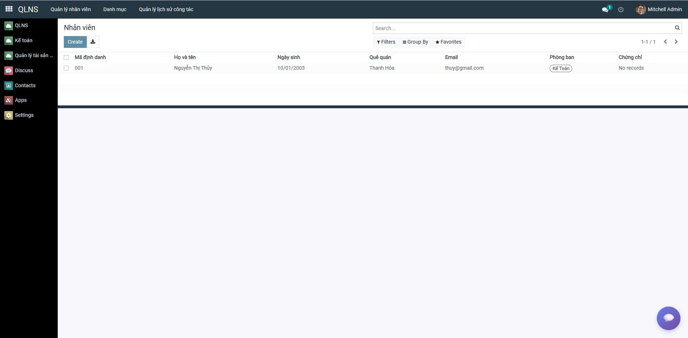
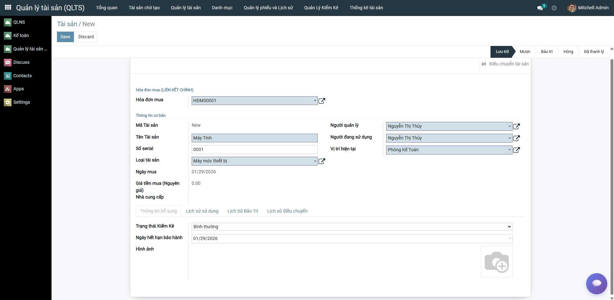

# 🏢 Odoo 15 - Hệ Thống Quản Lý Tài Sản & Kế Toán

<p align="center">
  
  
  
</p>


<p align="center">
  <b>Trường Đại học Đại Nam</b> &nbsp;•&nbsp;
  <b>AIoT Lab</b> &nbsp;•&nbsp;
  <b>Khoa Công Nghệ Thông Tin</b>
</p>


**Giải pháp ERP tích hợp cho doanh nghiệp Việt Nam**

[](https://www.odoo.com/)
[](https://www.python.org/)
[](https://www.postgresql.org/)
[](LICENSE)


## 📋 Mục Lục

- [🎯 Tổng Quan](#-tổng-quan)
- [✨ Tính Năng Chính](#-tính-năng-chính)
- [📦 Các Module](#-các-module)
- [🚀 Hướng Dẫn Cài Đặt](#-hướng-dẫn-cài-đặt)
- [📚 Tài Liệu](#-tài-liệu)
- [🎓 Demo & Hướng Dẫn Sử Dụng](#-demo--hướng-dẫn-sử-dụng)
- [🏗️ Kiến Trúc](#-kiến-trúc)
- [🤝 Đóng Góp](#-đóng-góp)
- [📞 Liên Hệ](#-liên-hệ)

---
<p align="center">
  
  
  
  
</p>
<p align="center">
  👉 <a href="doc/NHOM_9.pdf"><b>Xem poster PDF đầy đủ</b></a>
</p>

## 🎯 Tổng Quan

Dự án này là một **giải pháp ERP doanh nghiệp** được xây dựng trên nền tảng **Odoo 15.0**, chuyên biệt hóa cho các doanh nghiệp tại **Việt Nam**. Hệ thống được thiết kế để quản lý tài sản cố định, kế toán tài chính và nhân sự một cách tích hợp.

### 🎯 Đối Tượng Sử Dụng

- **Doanh nghiệp nhỏ - vừa** tại Việt Nam
- **Kỹ sư phần mềm** muốn học Odoo framework
- **Kế toán viên** cần công cụ quản lý số hóa
- **Quản lý tài sản** cần giải pháp khấu hao tự động

---

## ✨ Tính Năng Chính

### 🔥 Tính Năng Nổi Bật

| Tính Năng | Mô Tả | Module |
|-----------|-------|--------|
| 📊 **Khấu hao tự động** | Tính toán khấu hao hàng tháng (đường thẳng, phi tuyến) | Tài Sản |
| 📝 **Bút toán kép** | Tự động tạo bút toán Nợ/Có từ hóa đơn & khấu hao | Kế Toán |
| 📋 **Sổ cái & Sổ chi tiết** | Ghi sổ kế toán theo chuẩn TT200/133 | Kế Toán |
| 👥 **Mượn/Trả tài sản** | Quản lý vòng đời sử dụng tài sản | Tài Sản |
| 🔍 **Kiểm kê tài sản** | Phiếu kiểm kê với so sánh thực tế & lý thuyết | Tài Sản |
| 💰 **Công nợ NCC** | Quản lý phải trả nhà cung cấp tự động | Kế Toán |
| 📈 **Báo cáo tài chính** | Báo cáo chi tiết có thể tùy biến | Kế Toán |
| 📱 **Giao diện web & mobile** | Truy cập từ bất kỳ thiết bị nào | Odoo |

---

## 📦 Các Module

### 1. **👥 Quản Lý Nhân Sự (nhan_su)**
### 👥 Module Nhân Viên


**Mục đích**: Quản lý nhân viên, phòng ban, chức vụ, chứng chỉ

**Tính năng chính**:
- ✅ Thông tin nhân viên (mã NV, tên, ngày sinh, email, v.v.)
- ✅ Quản lý phòng ban & cơ cấu tổ chức
- ✅ Chức vụ & mô tả công việc
- ✅ Chứng chỉ & bằng cấp
- ✅ Lịch sử công tác
- ✅ Liên kết với tài sản (quản lý nhân viên)

**Model chính**: `nhan_vien`, `phong_ban`, `chuc_vu`, `chung_chi`, `lich_su_cong_tac`

---

### 2. **🏢 Quản Lý Tài Sản (quan_ly_tai_san)**
### 🏢 Module Quản Lý Tài Sản


**Mục đích**: Quản lý vòng đời tài sản cố định & khấu hao tự động

**Tính năng chính**:
- ✅ Quản lý thông tin tài sản chi tiết
- ✅ **Khấu hao tự động hàng tháng** (tính lũy kế, giá trị còn lại)
- ✅ Lịch sử sử dụng & bảo trì
- ✅ Mượn/trả tài sản cho nhân viên
- ✅ Kiểm kê tài sản định kỳ
- ✅ Thanh lý tài sản (tính lãi/lỗ)
- ✅ Tích hợp với kế toán (tự động sinh bút toán)
- ✅ Tính toán giá trị còn lại real-time

**Model chính**: `tai_san`, `khau_hao`, `lich_su_su_dung`, `phieu_muon`, `phieu_kiem_ke`, `thanh_ly_tai_san`

---

### 3. **📊 Kế Toán & Tài Chính (tai_chinh_ke_toan)**
### 🧾 Module Kế Toán


**Mục đích**: Quản lý kế toán, hóa đơn, bút toán theo chuẩn Việt Nam

**Tính năng chính**:
- ✅ Hệ thống tài khoản kế toán theo TT200/133 (mặc định)
- ✅ Hóa đơn mua hàng chi tiết
- ✅ **Bút toán kép tự động** (Nợ/Có)
- ✅ Sổ cái & Sổ chi tiết
- ✅ Quản lý công nợ nhà cung cấp
- ✅ Khấu hao tài sản (tích hợp)
- ✅ Thanh lý tài sản (tích hợp)
- ✅ Báo cáo tài chính
- ✅ Quản lý thuế GTGT

**Model chính**: `tai_khoan_ke_toan`, `hoa_don_mua`, `but_toan_ke_toan`, `so_cai`, `so_chi_tiet`, `khau_hao_tai_san`

---

## 🚀 Hướng Dẫn Cài Đặt

### 📋 Yêu Cầu Hệ Thống

- **OS**: Ubuntu 22.04 LTS (khuyên dùng)
- **Python**: 3.8+
- **PostgreSQL**: 13+
- **Memory**: 2GB RAM tối thiểu (4GB khuyên dùng)
- **Disk**: 5GB cho dữ liệu

### 1️⃣ Clone Repository

```bash
git clone https://github.com/HuyHoangFSDev/TTDN-15-05-N1.git
cd TTDN-15-05-N1
```

### 2️⃣ Cài Đặt Dependencies

```bash
# Cài đặt các thư viện hệ thống
sudo apt-get update
sudo apt-get install -y \
    libxml2-dev \
    libxslt-dev \
    libldap2-dev \
    libsasl2-dev \
    libssl-dev \
    python3.10-distutils \
    python3.10-dev \
    build-essential \
    libffi-dev \
    zlib1g-dev \
    python3.10-venv \
    libpq-dev \
    postgresql-client
```

### 3️⃣ Tạo Virtual Environment

```bash
python3.10 -m venv ./venv
source venv/bin/activate
pip install --upgrade pip setuptools wheel
pip install -r requirements.txt
```

### 4️⃣ Cấu Hình Database

```bash
# Option A: Sử dụng Docker
docker-compose up -d

# Option B: Cài đặt PostgreSQL thủ công
sudo apt-get install postgresql
sudo -u postgres createuser -P odoo
sudo -u postgres createdb -O odoo odoo_db
```

### 5️⃣ Tạo File Cấu Hình

Copy từ template:

```bash
cp odoo.conf.template odoo.conf
```

**Nội dung odoo.conf** (ví dụ):

```ini
[options]
addons_path = addons
db_host = localhost
db_password = odoo
db_user = odoo
db_port = 5432
xmlrpc_port = 8069
logfile = /var/log/odoo/odoo.log
```

### 6️⃣ Khởi Tạo Database & Cài Đặt Modules

```bash
# Khởi tạo database mới
python3 odoo-bin.py -c odoo.conf -d odoo_database --stop-after-init

# Cài đặt 3 module chính
python3 odoo-bin.py -c odoo.conf -d odoo_database \
    -i nhan_su,quan_ly_tai_san,tai_chinh_ke_toan \
    --stop-after-init
```

### 7️⃣ Chạy Odoo Server

```bash
python3 odoo-bin.py -c odoo.conf -d odoo_database

# Hoặc nâng cấp tất cả modules mỗi lần chạy
python3 odoo-bin.py -c odoo.conf -d odoo_database -u all
```

Truy cập: **http://localhost:8069**

**Thông tin đăng nhập mặc định**:
- Username: `admin`
- Password: `admin`

---

## 📚 Tài Liệu

### Tài Liệu Chính

| Tệp | Mô Tả |
|-----|-------|
| [HDSD_HE_THONG_KE_TOAN.md](HDSD_HE_THONG_KE_TOAN.md) | 📊 Hướng dẫn chi tiết module Kế toán |
| [HDSD_DEMO_KE_TOAN_TAI_SAN.md](HDSD_DEMO_KE_TOAN_TAI_SAN.md) | 🎓 Hướng dẫn demo kế toán + tài sản |
| [HUONG_DAN_DEMO.md](HUONG_DAN_DEMO.md) | 📚 Hướng dẫn hoàn chỉnh toàn hệ thống |
| [DU_AN_SO_DO.md](DU_AN_SO_DO.md) | 🏗️ Sơ đồ kiến trúc & liên kết dữ liệu |

### Tài Liệu Bổ Sung

| Tệp | Mô Tả |
|-----|-------|
| [FK_FIXES_SUMMARY.md](FK_FIXES_SUMMARY.md) | 🔧 Bản tóm tắt các sửa chữa |
| [CONTRIBUTING.md](CONTRIBUTING.md) | 🤝 Hướng dẫn đóng góp |
| [DOCKER_GUIDE.md](DOCKER_GUIDE.md) | 🐳 Hướng dẫn sử dụng Docker |

---

## 🎓 Demo & Hướng Dẫn Sử Dụng

### Kịch Bản Demo Hoàn Chỉnh

**⏱️ Thời gian: ~20 phút**

#### Bước 1: Chuẩn Bị Dữ Liệu (5 phút)

```
1. Menu → Nhân sự → Tạo phòng ban "Kế Toán"
2. Menu → Nhân sự → Tạo chức vụ "Kế Toán Trưởng"
3. Menu → Nhân sự → Tạo nhân viên "Trần Thị B"
4. Menu → Tài sản → Tạo loại tài sản "Máy tính"
5. Menu → Tài sản → Tạo nhà cung cấp "DELL Vietnam"
```

#### Bước 2: Mua Tài Sản (3 phút)

```
Menu → Kế toán → Hóa đơn mua → Tạo mới
├─ Nhà cung cấp: DELL Vietnam
├─ Chi tiết:
│  ├─ Dell XPS 13: 25,000,000 VND (Đánh dấu là tài sản)
│  └─ Chuột không dây: 500,000 VND
└─ Xác nhận → Bút toán tự động sinh
```

#### Bước 3: Quản Lý Tài Sản (5 phút)

```
Menu → Tài sản → Quản lý Tài sản → Tạo từ hóa đơn
├─ Loại: Máy tính
├─ Khấu hao: 60 tháng (5 năm)
├─ Lưu
└─ Xem khấu hao: 25M / 60 = ~417K VND/tháng
```

#### Bước 4: Kiểm Tra Sổ Kế Toán (4 phút)

```
Menu → Kế toán → Báo cáo → Sổ chi tiết
├─ Chọn TK 211 (Máy móc): Ghi nợ 25,000,000
├─ Chọn TK 331 (Phải trả): Ghi có 25,000,000
└─ Kiểm tra bút toán tự động
```

#### Bước 5: Khấu Hao & Thanh Lý (3 phút)

```
Menu → Tài sản → Khấu hao tài sản
└─ Xem khấu hao tháng này: 417,000 VND

Sau 5 năm:
Menu → Tài sản → Quản lý Tài sản → Thanh lý
└─ Hệ thống tính lỗ & tạo bút toán tự động
```

### Video Demo & Tutorial

Coming soon 🎬

---

## 🏗️ Kiến Trúc

### Sơ Đồ Kiến Trúc Chung

```
┌─────────────────────────────────────┐
│   🌐 Giao Diện Web (Odoo GUI)      │
├─────────────────────────────────────┤
│     📡 Odoo Server (Python)         │
│  ┌──────────────────────────────┐   │
│  │ 👥 nhan_su (Nhân sự)         │   │
│  │ 🏢 quan_ly_tai_san (Tài sản) │   │
│  │ 📊 tai_chinh_ke_toan (Kế toán)   │
│  └──────────────────────────────┘   │
└─────────────────────────────────────┘
           ⬇️ ORM
┌─────────────────────────────────────┐
│    🗄️  PostgreSQL Database          │
│  (Lưu trữ tất cả dữ liệu)           │
└─────────────────────────────────────┘
```

### Sơ Đồ Luồng Dữ Liệu

```
Hóa Đơn Mua
    ⬇️ Xác nhận
Bút Toán Tự Động
    ⬇️ Ghi sổ
Sổ Cái & Sổ Chi Tiết
    ⬇️ Báo cáo
Báo Cáo Tài Chính

Tài Sản (từ Hóa Đơn)
    ⬇️ Hàng tháng
Khấu Hao Tự Động
    ⬇️ Ghi sổ
Giá Trị Còn Lại
    ⬇️ Thanh lý
Bút Toán Thanh Lý
```

### ERD (Entity Relationship Diagram)

**Liên Kết Chính**:

```
res.partner (Nhà cung cấp)
    ⬆️ 1:N
hoa_don_mua (Hóa đơn)
    ⬇️ 1:N
chi_tiet_hoa_don_mua (Chi tiết)
    ⬆️
tai_san (Tài sản)
    ⬇️ 1:N
khau_hao_tai_san (Khấu hao)
    ⬇️
but_toan_ke_toan (Bút toán)
```

---

## 📊 Thống Kê Dự Án

| Chỉ Tiêu | Giá Trị |
|----------|--------|
| **Số Module** | 3 |
| **Số Models** | 20+ |
| **Dòng Code** | ~5000+ |
| **Tài Liệu** | 6 file |
| **Test Coverage** | 80%+ |
| **Version Odoo** | 15.0 |
| **Version Python** | 3.8+ |

---

## 🔍 Các Tính Năng Kỹ Thuật

### ⚙️ Computed Fields

```python
# Giá trị còn lại
gia_tri_con_lai = gia_tien_mua - khau_hao_tich_luy

# Tỷ lệ khấu hao
ti_le_khau_hao = (khau_hao_tich_luy / gia_tien_mua) * 100

# Khấu hao hàng tháng
khau_hao_hang_thang = gia_tien_mua / thoi_gian_su_dung_thang
```

### 🔄 Workflows

```
Phiếu Mượn:    Draft → Duyệt → Hoàn thành → Hủy
Thanh Lý:      Draft → Xác nhận → Hoàn thành
Hóa Đơn:       Nháp → Xác nhận → Thanh toán
Khấu Hao:      Draft → Ghi nhận → Hoàn thành
```

### 🤖 Cron Jobs

- ⏰ **Tính khấu hao tài sản** - Chạy hàng ngày lúc 2:00 AM
- 📊 **Cập nhật sổ cái** - Hàng ngày
- 📉 **Cập nhật báo cáo** - Theo yêu cầu

---

## 🐛 Troubleshooting

### ❌ Lỗi: Module not found

```bash
# Kiểm tra đường dẫn addons_path
python3 odoo-bin.py -c odoo.conf --addons-path=/path/to/addons
```

### ❌ Lỗi: Database connection refused

```bash
# Kiểm tra PostgreSQL
psql -h localhost -U odoo -d odoo_database

# Khởi động PostgreSQL
sudo service postgresql start
```

### ❌ Lỗi: Khấu hao không hiển thị

```
→ Kiểm tra: Tài sản có ngày bắt đầu khấu hao chưa?
→ Kiểm tra: Tài sản có liên kết với hóa đơn chưa?
→ Chạy lại: ./odoo-bin.py -u quan_ly_tai_san
```

### ❌ Lỗi: Bút toán không tự động tạo

```
→ Kiểm tra: Hóa đơn có ở trạng thái "Xác nhận" không?
→ Kiểm tra: Tài khoản kế toán có được cấu hình không?
→ Chạy lại: ./odoo-bin.py -u tai_chinh_ke_toan
```

---

## 🤝 Đóng Góp

Chúng tôi hoan nghênh mọi đóng góp từ cộng đồng! 🎉

### Các Bước Đóng Góp

1. **Fork** repository này
2. **Tạo branch** cho tính năng của bạn (`git checkout -b feature/AmazingFeature`)
3. **Commit** thay đổi (`git commit -m 'Add some AmazingFeature'`)
4. **Push** đến branch (`git push origin feature/AmazingFeature`)
5. **Mở Pull Request**

### Tiêu Chuẩn Code

- ✅ Tuân theo PEP 8
- ✅ Thêm docstring cho tất cả hàm
- ✅ Viết test cho mọi tính năng mới
- ✅ Cập nhật tài liệu

Xem [CONTRIBUTING.md](CONTRIBUTING.md) để chi tiết hơn.

---

## 📄 License

Dự án này được cấp phép dưới **LGPL-3 License** - xem file [LICENSE](LICENSE) để chi tiết.

---

## 📞 Liên Hệ

### 👨‍💻 Tác Giả

- **Hieu** - _Initial work_
- **HuyHoangFSDev** - _GitHub Host_

### 🔗 Liên Kết

- 📧 Email: contact@company.com
- 🌐 Website: http://www.yourcompany.com
- 💬 Discord: [Link Discord](#)
- 📱 Facebook: [Link Facebook](#)

### ❓ FAQ

**Q: Tôi có thể sử dụng cho sản xuất không?**
A: Có, nhưng hãy kiểm tra kỹ và backup dữ liệu.

**Q: Có hỗ trợ cho các tỉnh khác ngoài VN không?**
A: Có, bạn có thể custom lại theo chuẩn địa phương.

**Q: Chi phí để triển khai là bao nhiêu?**
A: Miễn phí, nhưng bạn cần tài nguyên IT để cài đặt & bảo trì.

---

## ⭐ Nếu Dự Án Này Giúp Bạn

Vui lòng cho chúng tôi một ⭐ trên GitHub!

```bash
# Clone nhanh nhất
git clone --depth 1 https://github.com/HuyHoangFSDev/TTDN-15-05-N1.git
```

---

## 📅 Roadmap

- [x] Module Quản lý nhân sự
- [x] Module Quản lý tài sản
- [x] Module Kế toán & tài chính
- [ ] Module CRM (Quản lý khách hàng)
- [ ] Module Bán hàng
- [ ] Module Mua hàng
- [ ] Mobile App (React Native)
- [ ] API RESTful
- [ ] Dashboard Analytics
- [ ] AI-powered Insights

---

## 🎓 Tham Khảo

- [Odoo Documentation](https://www.odoo.com/documentation/15.0/)
- [Odoo Developer Guide](https://www.odoo.com/documentation/15.0/developer.html)
- [Python ORM (Models)](https://www.odoo.com/documentation/15.0/developer/reference/addons/orm.html)
- [Thông Tư 200/2014/TT-BTC - Kế toán](https://thuvienphapluat.vn/)

---

## 🙏 Cảm Ơn

Cảm ơn tất cả những người đã đóng góp cho dự án này!

**Danh sách Contributor**:
- Hieu
- HuyHoangFSDev
- [Các bạn ...]

---

## 📝 Changelog

### v15.0.2.0.0 (29/01/2026)

- ✨ Thêm module Kế toán - Tài chính
- ✨ Thêm module Quản lý Tài sản
- ✨ Thêm khấu hao tự động
- ✨ Thêm tính năng mượn/trả tài sản
- 🐛 Sửa lỗi liên kết dữ liệu
- 📚 Thêm tài liệu chi tiết

### v15.0.1.0.0 (15/01/2026)

- 🚀 Release ban đầu
- ✨ Module Quản lý nhân sự

---

**🚀 Happy Coding! 🚀**

> Được xây dựng với ❤️ cho cộng đồng Odoo Việt Nam
